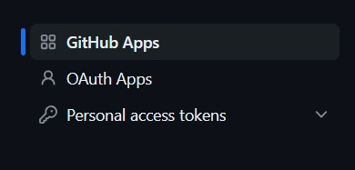

# Generate GitHub Personal Access Token

### Open GitHub Developer Settings

Visit https://github.com/settings/tokens for easy access.

Alternatively you can follow:
1. Visit https://github.com/
2. Click on Profile icon located at the upper right corner.
3. Click on setting option appeared on the pallet.

4. From the left nevigation menu select Developer Settings.

5. Click on Personal access tokens

6. Click on Fine-grained tokens.

### Generate new Token

1. Click on Generate new token.

2. Enter password.
3. Enter `Token name` as `automation-access-token`
4. Keep `Expiration` to default or make it 1 year if you want it for long term use.
5. Make `Repository access` to `All repositories`.
6. In `Permissions` under `Repository permissions` give `Read-only` access to Administration.
7. Click `Generate token`, and there you have it!